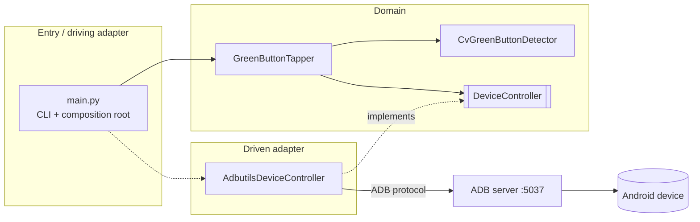
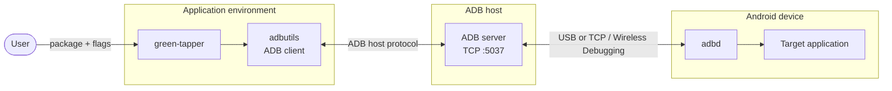
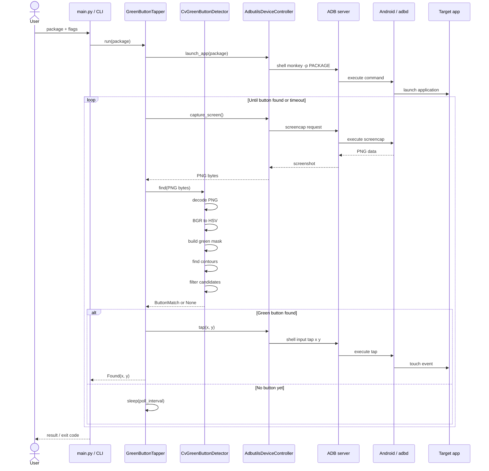

# green-tapper


Launch an Android app, detect a **green button** using computer vision, and tap it through ADB.

The ADB client implementation is based on [`adbutils`](https://github.com/openatx/adbutils).

### Install ADB

`green-tapper` requires **Android Debug Bridge (`adb`)** from the Android Platform Tools to be installed on the machine that manages the Android device. Therefore, the host machine must have `adb` installed and the target device must be visible in `adb devices`.

On macOS with Homebrew:

```bash
brew install --cask android-platform-tools
```

On Debian / Ubuntu:

```bash
sudo apt update
sudo apt install adb
```

Verify the installation:

```bash
adb version
adb devices -l
```

The setup was tested with Android Platform Tools 36.0.2.

---

## Table of contents

- [Important: USB issue on macOS + Samsung Galaxy A35](#important-usb-issue-on-macos--samsung-galaxy-a35)
  - [Recommended solution](#recommended-solution)
- [Architecture](#architecture)
- [Local installation](#local-installation)
  - [Requirements](#requirements)
  - [Create the environment](#create-the-environment)
  - [Environment configuration](#environment-configuration)
- [Local run](#local-run)
- [Docker](#docker)
  - [Build](#build)
  - [Run with Docker Compose](#run-with-docker-compose)
- [Development](#development)
  - [Linting](#linting)
  - [Testing](#testing)
- [Runtime topology](#runtime-topology)
- [Execution sequence](#execution-sequence)
- [Troubleshooting](#troubleshooting)
- [Contact](#contact)

---

## Important: USB issue on macOS + Samsung Galaxy A35

During development, ADB screenshot transfers over a physical USB connection were unstable on the tested setup:

- macOS / Apple Silicon;
- Samsung Galaxy A35;
- Android Platform Tools 36.x / 37.x.

Small ADB commands such as:

```bash
adb shell echo hello
```

worked correctly, while larger transfers such as:

```bash
adb exec-out screencap -p
```

could return only a partial PNG and then cause the phone to disappear from:

```bash
adb devices
```

The same behaviour was reproduced with the official `adb` CLI, so the problem was not specific to Python, `adbutils`, or the application itself.

### Recommended solution

Use **Android Wireless Debugging**.

On the phone:

```text
Settings
→ Developer options
→ Wireless debugging
→ Pair device with pairing code
```

Then on the Mac:

```bash
adb pair <phone-ip>:<pairing-port>
```

Enter the pairing code shown on the phone.

After pairing, return to the main **Wireless debugging** screen and use the connection address shown there:

```bash
adb connect <phone-ip>:<connection-port>
```

Verify:

```bash
adb devices -l
```

Example:

```text
192.168.1.54:41237    device
```

The USB cable can then be disconnected.

If no explicit serial is provided, `green-tapper` uses the single attached device. When several devices are attached, it fails fast and a serial must be supplied (via `--serial` or `ANDROID_SERIAL`).

---

## Architecture

The project follows a small **ports and adapters / hexagonal architecture**.

The domain layer depends only on the `DeviceController` abstraction and does not depend directly on `adbutils`.

```text
src/
├── adapters/
│   ├── adbutils_device_controller.py
│   └── errors.py
│
├── cli/
│   └── parser.py
│
├── domain/
│   ├── device_controller.py
│   ├── cv_green_button_detector.py
│   └── green_button_tapper.py
│
├── settings.py
└── main.py
```



---

# Local installation

## Requirements

- Python `3.12`
- Poetry
- Android Platform Tools / ADB
- an Android device available through the ADB server

Python dependencies are defined in `pyproject.toml`.

Main runtime dependencies:

```text
numpy==2.5.3
opencv-python-headless==4.14.0.94
adbutils==2.12.0
```

Development / test dependencies:

```text
pytest==8.4.2
ruff==0.16.9
```

All of the above are installed automatically by `poetry install` (see [Create the environment](#create-the-environment)); no manual `pip install` of individual packages is required.

---

## Create the environment

From the project root:

```bash
python3.12 -m venv .venv
```

Activate it:

```bash
source .venv/bin/activate
```

Install Poetry:

```bash
pip install --upgrade pip poetry
```

Install project dependencies:

```bash
poetry install
```

---

## Environment configuration

Create the local `.env` file from the provided example:

```bash
cp .env.example .env
```

The application reads runtime configuration from `.env`.

For a local run, the ADB server normally runs on the same machine:

```env
ADB_HOST=127.0.0.1
ADB_PORT=5037
```

For Docker Desktop on macOS:

```env
ADB_HOST=host.docker.internal
ADB_PORT=5037
```

Other runtime values such as timeout and polling interval can also be configured through `.env` if they are present in `.env.example`.

---

# Local run

First make sure the device is visible:

```bash
adb devices -l
```

For Wireless Debugging it should look similar to:

```text
List of devices attached
192.168.1.54:41237    device
```

Run:

```bash
python src/main.py com.android.settings
```

General form:

```bash
python src/main.py <package> [options]
```

With options:

```bash
python src/main.py com.android.settings \
  --timeout 10 \
  --poll-interval 0.5
```

Explicit ADB server:

```bash
python src/main.py com.android.settings \
  --adb-host 127.0.0.1 \
  --adb-port 5037
```

Explicit device:

```bash
python src/main.py com.android.settings \
  --serial 192.168.1.54:41237
```

If `--serial` is omitted, the single attached device is used; with several devices attached, resolution fails fast and a serial is required.

---

# Docker

The Docker image contains:

- Python 3.12;
- project dependencies;
- `adbutils`;
- OpenCV runtime dependencies.

The container does **not** need the `adb` binary.

`adbutils` connects directly to an ADB server over TCP.

The source directory is mounted into the container, so changing Python code does not require rebuilding the image.

Before running Docker, create `.env` if it does not exist:

```bash
cp .env.example .env
```

For Docker Desktop on macOS:

```env
ADB_HOST=host.docker.internal
ADB_PORT=5037
```

---

## Build

Using Docker Compose:

```bash
docker compose build
```

Or directly with Docker:

```bash
docker build -t green-tapper:latest .
```

---

## Run with Docker Compose

Run:

```bash
docker compose run --rm green-tapper com.android.settings
```

Because the Dockerfile contains:

```dockerfile
ENTRYPOINT ["python", "src/main.py"]
```

the command above becomes:

```bash
python src/main.py com.android.settings
```

inside the container.

With flags:

```bash
docker compose run --rm green-tapper \
  com.android.settings \
  --timeout 10 \
  --poll-interval 0.5 \
  --adb-host host.docker.internal \
  --adb-port 5037
```

With an explicit Wireless Debugging device:

```bash
docker compose run --rm green-tapper \
  com.android.settings \
  --adb-host host.docker.internal \
  --adb-port 5037 \
  --serial 192.168.1.54:41237
```

If `--serial` is omitted, the single attached device is used; with several devices attached, resolution fails fast and a serial is required.

---

# Development

Development uses two tools, both declared as dev dependencies in `pyproject.toml`
and installed by `poetry install`:

- **[ruff](https://docs.astral.sh/ruff/) 0.16.9** — linter (and import sorter).
- **[pytest](https://docs.pytest.org/) 8.4.2** — test runner.

The workflow while changing code is: **run the linter, then run the tests** — and
keep both green before committing. Neither needs a real phone or ADB server.

```bash
ruff check src tests     # lint
pytest                   # test
```

## Linting

`ruff` is configured under `[tool.ruff]` in `pyproject.toml` (line length 100,
rule sets `E`, `F`, `I`, `UP`, `B`, `SIM`, `A`).

```bash
ruff check src tests          # report issues
ruff check src tests --fix    # auto-fix the safe ones (imports, etc.)
```

## Testing

No real phone or ADB server is required: the unit tests mock the ADB adapter, and
the computer-vision tests run against PNG screenshots generated in memory.

Test layout:

```text
tests/
├── conftest.py                          # shared fixtures (generated screenshots)
├── unit/
│   ├── test_adbutils_device_controller.py
│   ├── test_cli_parser.py
│   ├── test_cv_green_button_detector.py
│   ├── test_green_button_tapper.py
│   ├── test_main.py
│   └── test_settings.py
└── integration/
    └── test_tap_flow.py
```

Run the whole suite from the project root:

```bash
pytest
```

Run only the fast unit tests (skip the integration ones):

```bash
pytest -m "not integration"
```

Run only the integration tests:

```bash
pytest -m integration
```

Run a single file or test:

```bash
pytest tests/unit/test_cv_green_button_detector.py
pytest tests/unit/test_settings.py::test_missing_required_var_fails_fast
```

`testpaths` and `pythonpath` are already configured under `[tool.pytest.ini_options]` in `pyproject.toml`, so `pytest` can be run without extra flags.

---

# Runtime topology

The application does not communicate with the Android device directly.

`green-tapper` uses `adbutils` as an ADB client. `adbutils` communicates with a running **ADB server**, and the ADB server communicates with `adbd` on the Android device.

The ADB server may run:

- on the same machine during a local run;
- on the Docker host when the application runs inside a container;
- on another reachable host if a remote ADB server is used.



For a native local run, the application and the ADB server normally run on the same host.

For Docker, the topology is typically:

```text
Docker container
    ↓
green-tapper
    ↓
adbutils
    ↓
host.docker.internal:5037
    ↓
ADB server on host
    ↓
Wireless Debugging
    ↓
Android device
```

---

# Execution sequence

This diagram shows the actual runtime interaction between the user, application, detector, ADB adapter, ADB server, and Android device.



The detector itself works only with screenshot bytes and coordinates. It does not access Android UI metadata or the application's widget tree.

---

# Troubleshooting

## Device is not visible

Check:

```bash
adb devices -l
```

If nothing is listed, verify that:

- Wireless Debugging is enabled;
- the computer and phone are on the same network;
- the device has been paired;
- the Wi-Fi ADB connection is active.

Reconnect if necessary:

```bash
adb connect <phone-ip>:<connection-port>
```

---

## Device disappears after `screencap`

If the device disappears from `adb devices` after a screenshot request over USB, use Wireless Debugging instead.

This issue was reproduced on the tested environment:

```text
macOS / Apple Silicon
Samsung Galaxy A35
Android Platform Tools 36.x / 37.x
```

The failure was also reproduced through the official ADB CLI, which indicates that it is not caused specifically by `adbutils` or the application.

---

## Docker cannot reach the ADB server

From Docker Desktop on macOS, use:

```text
host.docker.internal
```

instead of:

```text
127.0.0.1
```

because `127.0.0.1` inside the container refers to the container itself.

Example:

```env
ADB_HOST=host.docker.internal
ADB_PORT=5037
```

If the ADB server is running on another machine, use that machine's reachable IP address or hostname instead.

---

## Multiple devices are connected

Pass the target serial explicitly:

```bash
python src/main.py com.android.settings \
  --serial 192.168.1.54:41237
```

Or with Docker:

```bash
docker compose run --rm green-tapper \
  com.android.settings \
  --serial 192.168.1.54:41237
```

If no serial is provided, the application uses the single attached device; with several attached it fails fast and a serial is required.

---

## Contact

Andrei Banakh

Telegram: https://t.me/abanakh
